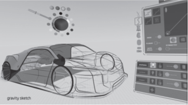

<!--
title: CPS和虚实融合
subtitle: 工业软件
author: 网络
keyword: 工业软件
published: 2024-04-222
topicImg: assets/4/CPSVR.jpg
-->

# CPS和虚实融合

2006年，美国国家科学基金会（NSF)举办了第一届CPS研讨会，会上第一次对CPS的内涵进行了阐述：CPS是赛博空间（cyberspace)中的通信（communication)、计算（computation)和控制（control)与实体系统在所有尺度内的深度融合。CPS的狭义内涵：实体系统里面的物理规律以信息的方式来表达；其广义内涵：对实体系统内变化性、相关性和参考性规律的建模、预测、优化和管理。CPS的基础在可见的世界中包括物联网、普适计算和执行机构，它们定义了实体系统的功能性，是感知和反馈的基础。在不可见世界中的资源（resource)、关系（relationship)和参考（reference)构成了实体系统运行的基础，是CPS在赛博空间中的管理目标。CPS中的通信（communication)、计算（computation)和控制（control)是管理可见世界的技术手段，而建立面向实体空间内的比较性（comparison)、关系性（correlation)和目的关联性（consequence)的对称性管理是核心的分析手段。而CPS的最终目标，是在赛博空间中对实体空间中3V的精确管理，即可视性（visualizability)、差异性（variation)和价值性（value)。
 
一般而言，可见空间中的实体其实包括两个世界：一是可见的实体；二是不可见的、体现实体内涵关系和规律的虚拟世界。如人作为一个实体是可见的，但又有不可见的一面，如他在微信空间中建立的关系世界，以及他的内涵、特质等。产品也有实体和虚体两个世界，实体是可见的，但内含的某些关系、特质、物理规律往往是不可见的。因此，只有虚实融合，才能真实地反映一个实体。实体空间是构成真实世界的各类要素和活动个体，包括环境、设备、系统、集群、社区、人员活动等。而赛博空间是上述要素和个体的精确同步和建模，实现CPS的镜像基础。赛博空间不只是对实体的几何描述而形成的几何空间，还包括反映实体的特质、内涵的物理规律以及实体的动态状况等的所有数字比特的集合。一个产品的设计数据、运行的动态数据、分析和优化后的衍生数据，以及人为构建的数字孪生体等，均在赛博空间之中。需要特别注意的是：
 
只有在数字空间（赛博空间）才能真正反映实体的内涵、特质、动态等。
 
这也就是为什么CPS被认为是工业4.0以及智能制造的核心理念。
 
那么数字空间（赛博空间、虚拟空间）的主要形式是什么？一切由数字系统形成的空间可被认为是数字空间或虚拟空间，如大数据、物联网等形成的数字空间。这里特别阐述与企业产品紧密相关的数字孪生、仿真和虚拟现实技术。
 
 
## 1. 产品的数字孪生体
 
 
促成数字孪生技术应用所需基础要素的部署一直在加速。
 
（1）仿真。构建数字孪生技术所需工具的能力和成熟度都在不断提高。现在，人们可以设计复杂的假设仿真情景，从探测到的真实情况回溯，执行数百万次的仿真流程也不会使系统过载。而且，随着供应商数量的增加，选择范围也在持续扩大。同时，机器学习功能正在增强洞察的深度和使用性。
 
（2）新的数据源。实时资产监控技术如激光探测及测距系统（light detection and ranging，LIDAR）与菲利尔（FLIR）前视红外热像仪产生的数据，现在已经可以整合到数字孪生体内。同样地，嵌入机器内部的或部署在整个供应链的物联网传感器，可以将运营数据直接输入到仿真系统中，实现不间断的实时监控。
 
（3）互操作性。过去10年里，将数字技术与现实世界相结合的能力已经得到显著提高。这一改善主要得益于物联网传感器、操作技术之间工业通信标准的加强，以及供应商为为集成多种平台集成做的努力。
 
（4）可视化。创建数字孪生体所需的庞大数据量可能会使分析变得复杂，如何获得有意义的洞察就变得更具挑战性。先进的数据可视化可以通过实时过滤和提取信息来应对该挑战。最新的数据可视化工具除了拥有基础看板和标准可视化功能之外，还包括交互式3D、基于VR和AR的可视化、支持AI的可视化以及实时媒体流。
 
（5）仪器。无论是嵌入式的还是外置的物联网传感器都变得越来越小，并且精确度更高、成本更低、性能更强大。随着网络技术和网络安全的提高，可以利用传统控制系统获得关于真实世界更细粒度、更及时、更准确的信息，以便与虚拟模型集成。
 
（6）平台。增加功能强大且价格低廉的计算能力、网络和存储的可用性和访问是数字孪生技术的关键促成要素。一些软件公司在基于云平台、物联网和分析技术领域进行了大量投资，紧跟数字孪生潮流。其中部分投资正在用于简化行业特定数字孪生应用的开发工作。
 
近年来，数字孪生技术已经引起越来越多的学者和企业的关注，其基本的应用肯定是围绕产品，生产系统的数字孪生体于设备制造商而言也可认为是围绕产品的。数字孪生技术在产品的全生命周期都能发挥作用，其展现的虚拟空间与生产设备等形成的物理空间的融合正是智能制造的关键所在。
 
 
## 2. 仿真
 
 
企业的很多工作都可以在仿真工具的虚拟空间中预先进行模拟，如产品设计、工艺过程、装配等。图1所示是利用Ansys系统进行整车气动性能分析的画面。
 
 

 
整车气动性能分析是从空气动力学角度分析汽车动力性、经济性和操纵稳定性，致力于降低空气阻力、改善气流升力和车身稳定性。ANSYS高效率的外空气动力学解决方案，帮助用户快速获得精确的整车气动性能，优化气动设计。
 
 
## 3. 虚拟现实等
 
 
虚拟现实（VR）乃至泛现实（XR）显然是典型的虚拟空间。
 
虚拟现实就是通过各种技术在计算机中创建一个虚拟世界，用户可以沉浸其中。增强现实技术通过对摄影机影像的位置及角度精算，加以图像分析技术，屏幕上的虚拟世界能够与现实世界场景进行结合、互动。而混合现实技术，能结合真实和虚拟世界，创造新的环境，能让物理实体和数字对象共存，实时相互作用，从而将现实、增强现实、增强虚拟和虚拟现实混合在一起。
 
现在已有一些虚拟现实的开发工具。Gravity Sketch开发了一款特定的智能面板来绘制3D模型，用户可以在触摸屏和Wacom手写板上绘制设计3D模型，然后通过VR虚拟现实设备，使用VR手柄在立体空间中进行模型设计。Gravity Sketch 甚至能将VR技术与3D打印结合，为用户带来一次全新的神奇体验。这个设计工具的直观性使设计师走进自己的创作世界。设计师们甚至可以进一步合作，实现想法的无缝沟通，进入到共同创作的虚拟环境中。通过Gravity Sketch进行模型设计，可以带来非常极致的沉浸感。用户可以在VR的虚拟立体空间中尽兴地展现现象力，Gravity Sketch整合了3D输出端口，用户可以将自己的设计成果通过3D打印机直接制作，从设计理念到制作成品，GravitySketch让3D打印变得非常便捷。图2是Gravity Sketch 的一个示意图。
 
 

注：本文转载自https://www.clii.com.cn/lhrh/hyxx/202107/t20210702_3950155.html